# SPLITZ
## App for tracing expenses shared with your friends
Frontend : Angular 16, RxJS, Bootstrap, Google Authentication, JWT Authentication  
Backend : Node, Expres and MongoDB

## Main Features
1. Create a group with your friends.
2. Records you shared expenses with the group
3. Overview the split amount between group members and see who owe how much.


## Project Dependencies

To build and run this project, you'll need the following tools.

* Node.js - [Install Node.js 12x+](https://nodejs.org/en/), including the NPM package management tool.
* Angular CLI - [Install the Angular CLI](https://angular.io/cli)


##  Backend
To configure the backend: 
1. create a config.env file under 'config' folder
2. create the following environment variables 
```
PORT = 3000
DB_URL="YOUR_MONGODB_URL"
JWT_PRIVATE_KEY='YOUR_JWE_EKY'
AWS_ACCESS_KEY_ID=YOUR_AWS_KEY
AWS_SECRET_ACCESS_KEY=YOUR_AWS_SECRECT_KEY
AWS_BUCKET_NAME=YOUR_S3_BUCKET_NAME

```
3. install dependencies and run the application

```console
foo@bar:~$: cd splitz-backend
foo@bar:~$: npm install
foo@bar:~$: npm run dev
```


## Front End
To run this application for the first time, run the following in your shell:

```console
foo@bar:~$: cd splitz-frontend
foo@bar:~$: npm install
foo@bar:~$: ng serve
```
Open up the browser to http://127.0.0.1:4200 to view the application

## Screenshots
Sign In Page           | Register Page  |  Google Sign IN Page
:-------------------------:|:-------------------------:|:-------------------------:
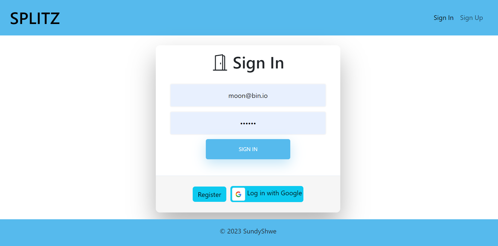  |  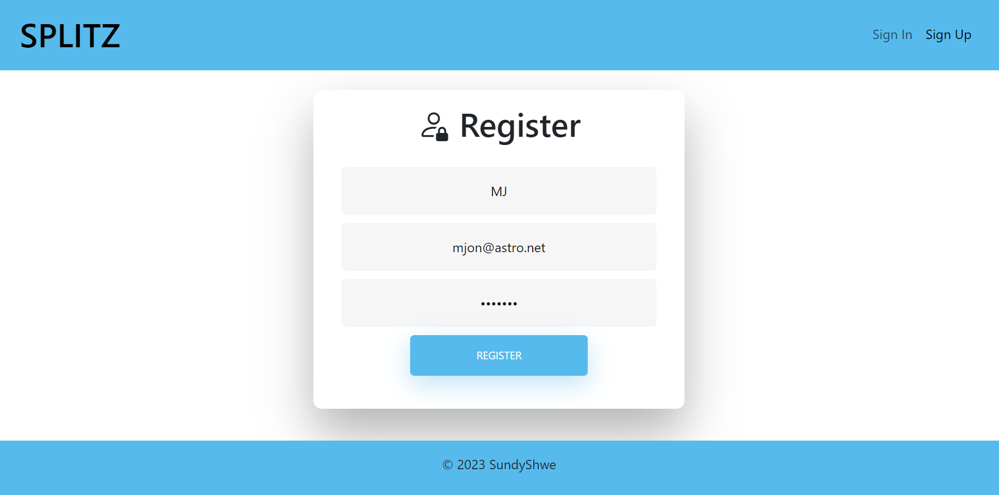 | 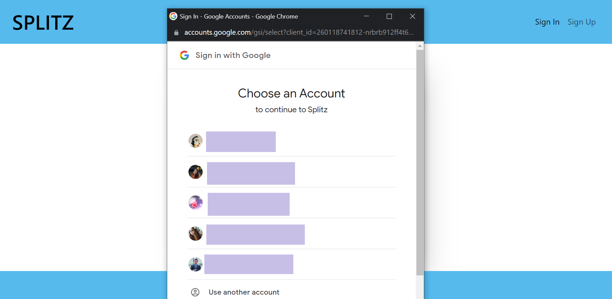

Landing Page           | Group List Page  |  Group Detial Page
:-------------------------:|:-------------------------:|:-------------------------:
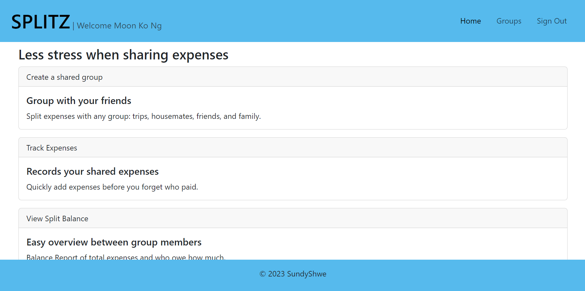  |  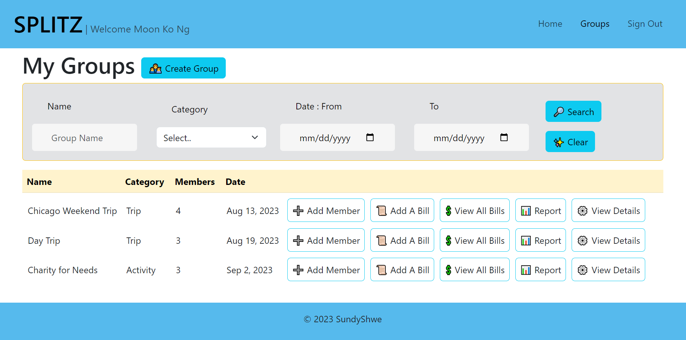 | 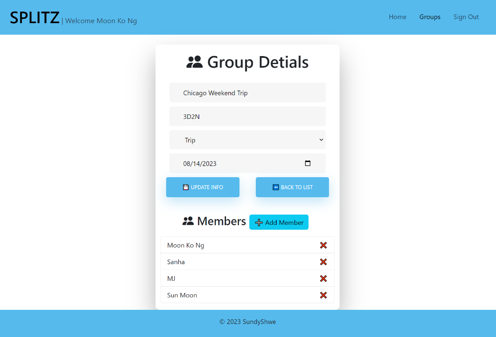

Add Group           | Add Member  |  Add Bill
:-------------------------:|:-------------------------:|:-------------------------:
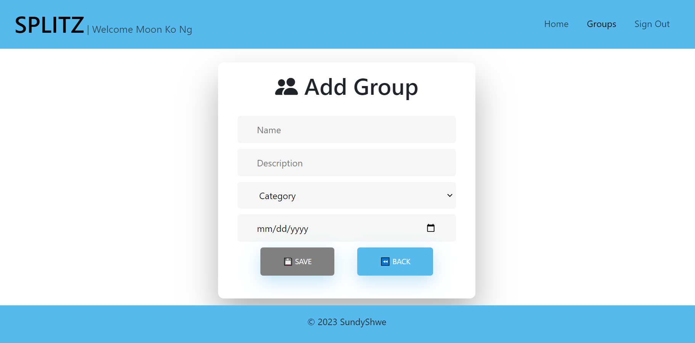  |  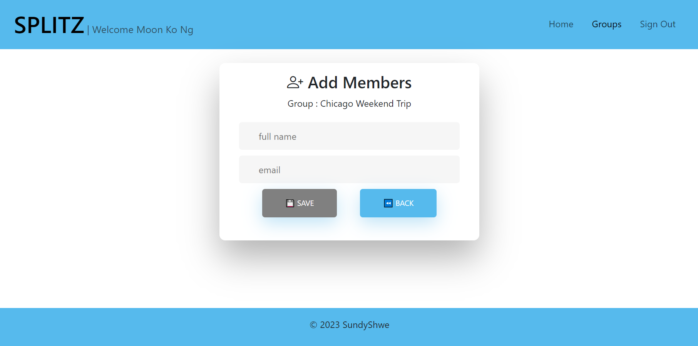 | 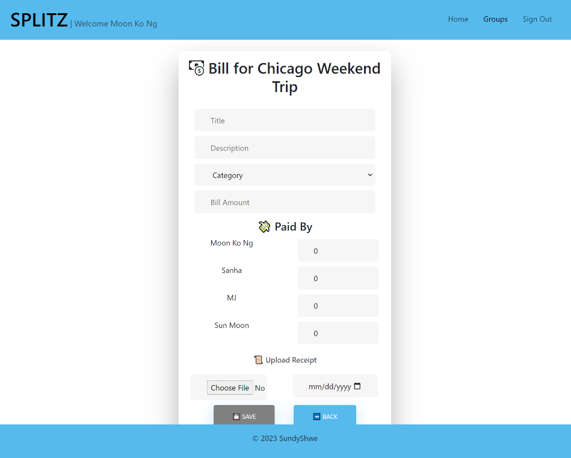

Bill List         | Bill Details  |  Split Report by Group
:-------------------------:|:-------------------------:|:-------------------------:
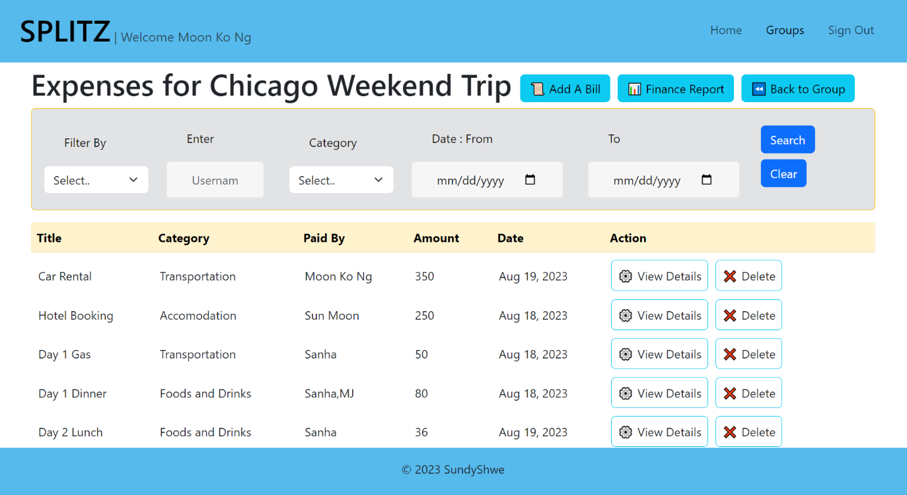  |  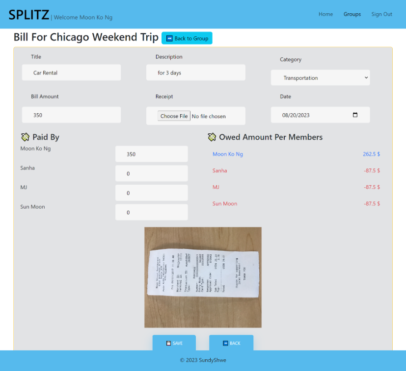 | 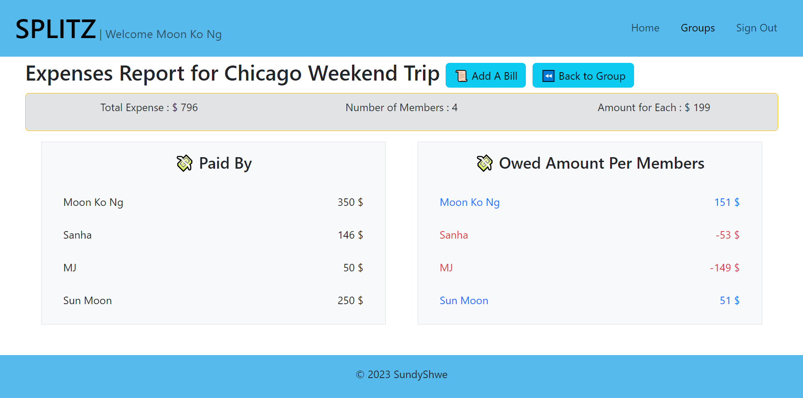

